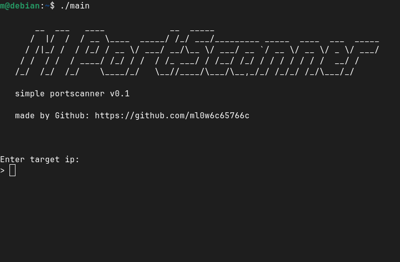

# MPortScanner



A simple TCP port scanner written in C (built as a learning project).

## Build

```bash
gcc portscanner.c -o portscanner
```

## Usage

```bash
./portscanner
```

Enter the target IP and a port range. The scanner will show all open ports.

## How It Works

For each port in the range, it tries to open a TCP connection. If it succeeds, the port is open. If not, its closed.

## Note

Only scan systems you own or have permission to test.

## Leave a Star 

If you like this project feel free to leave a star.
